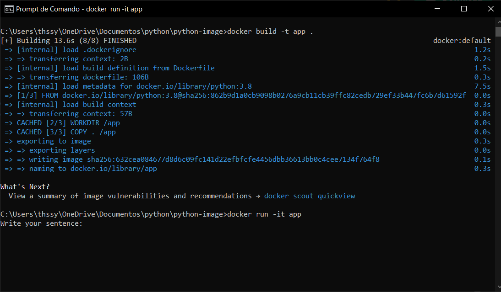

#  🐳 Palindrome Verificator 🐍
## Status: Concluded ✅


The project consists of running a **"Palindrome Verificator"** python script with a docker image created for this.

### What does the script do?

Identifies if a word is a palindrome or no by ignoring the symbols such as **",.!?:;"**, spaces and upper and lower case letters. This means you can write a sentence and it will return True or False.

#### Examples
```bash 
Write your sentence: Racecar
True
Write your sentence: Car
False
```


## Requisites
Before you go, make sure you have [Docker 24.0.6](https://www.docker.com/products/docker-desktop/) and [Python 3.0.8](https://www.python.org/downloads/)

## Hands-on

First install Python and after with docker open, go to the shell and go to the directory where you cloned the repository and execute:
```bash
docker -t build app .
docker run -it app
```

After you make this a shell you should see this window:
</img>

Enjoy your Palindrome Verificator in docker 🐳
</img>

# Tools ⚒️
🐳 [Docker 24.0.6](https://www.docker.com/products/docker-desktop/) 🐳

🐍 [Python 3.0.8](https://www.python.org/downloads/) 🐍